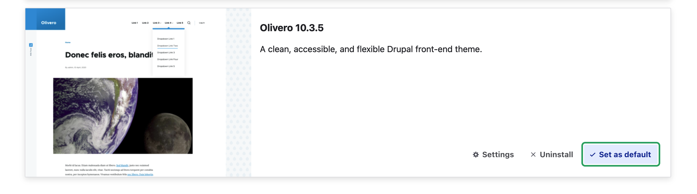
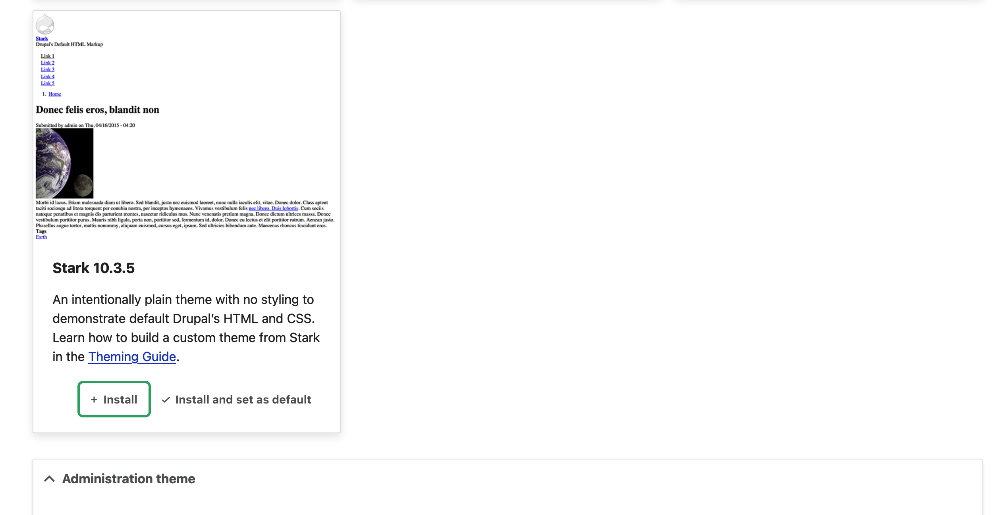

# Theming Concepts

Drupal 8 introduced a new theming layer that helps reduce complexity for
designers and frontend developers.

Also of significance is the use of Twig as the default templating engine.
See [Twig Syntax](3.3-twig-syntax.md) and [Twig Templates](3.4-twig-templates.md) for more information about using Twig.

## Theme Configuration

All available themes can be found in the `Appearance` page.



You can change the default frontend theme by clicking `Set as default` next to the theme
you wish to activate.

---


You can change the default admin theme by change the `Administration theme`
dropdown value and clicking the save button.

---

If a theme hasn't been installed yet, you will need to install to enable it.



To do so, just click `Install` or `Install and set as default` for the theme
you wish to enable.

---

Default themes can also be set in your `system.theme.yml` configuration file.

For example:
```
admin: claro
default: olivero
```

---

Additional theme settings can be set by clicking `Settings` next to the theme
you wish to change.


---

## Additional Resources
- [drupal.org - Theming Drupal](https://www.drupal.org/docs/develop/theming-drupal)
- [drupal.org - Modifying a theme file](https://www.drupal.org/docs/8/theming-drupal-8/modifying-attributes-in-a-theme-file)
- [Themeing Differences in Drupal 6, 7, 8, 9 & 10](https://www.drupal.org/docs/8/theming-drupal-8/theming-differences-between-drupal-6-7-8)

---
